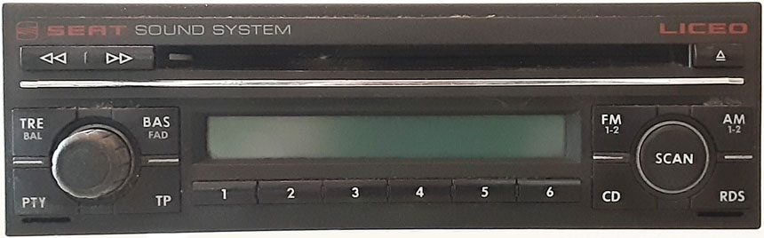

# Seat Liceo (Delco)

The Seat Liceo is a single-disc CD radio for the European market manufactured by Delco.  The radio
uses an NEC uPD78F0701Y microcontroller, which has the 78K0 instruction set.

## Microcontroller

The microcontroller in the Liceo only has Delco part numbers on the package ("EJ60 FLASH" and "09386083").  It
was decapsulated and the die markings identified it as an uPD78F0701Y.  

The firmware allows reading all of the flash memory over KWP1281 except the last by (which is part of the checksum).  In the I/O address range of 0xFF00-FFFF, the Liceo firmware uses all the same locations as the Premium 5 firmware, and also 5 additional ones.  Therefore, the uPD78F0701Y is a superset of the uPD78F0831Y found in the Premium 5.  The Liceo firmware also has many similarities to the Premium 5 firmware.
