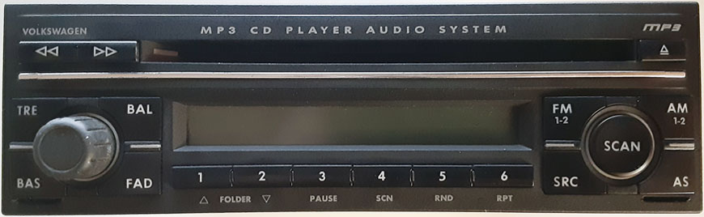

# VW Konzern 2004 MP3 (Delco)

The VW Konzern 2004 MP3 is a single-disc CD radio for the South American market manufactured by Delco.  It based on the [VW SAM 2002](../vw_sam_2002) and adds the ability to play MP3 files on CD.  

The primary difference between this radio and the VW SAM 2002 is that the CD mechanism has been replaced with a more powerful one that has an MP3 decoder on its board.  The mainboard has been slightly changed because the new CD mechanism has different connectors.  Aside from those connectors, the mainboard is nearly identical.  It retains the same 8-bit microcontroller (the "EJ60 FLASH", which is really an NEC uPD78F0701Y).  The firmware of the "EJ60 FLASH" has been updated and can display MP3 song data on the LCD.
