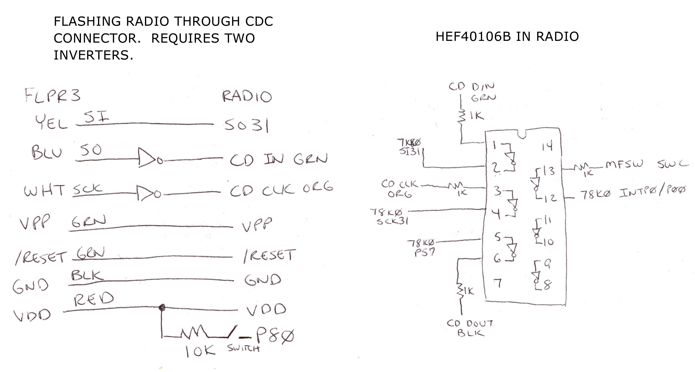

# Flash Programming

The NEC uPD78F0831Y "N60 FLASH" microcontroller can be programmed in-circuit in the Premium 5 radio using the [FL-PR3](https://web.archive.org/web/20180104213224/http://sys.ndk-m.com/download/?id=1348229202-851241) device programmer from [Naito Densei Machida](https://www.ndk-m.co.jp/).

Two of the signals required to flash are connected to the CD Changer port through a 16-pin SOIC chip marked either Philips HEF40106BT or Delco 16181209.  There are two ways to flash: with the HEF40106BT on the board or with it desoldered.  If the HEF40106BT is left on the board, a small circuit with an inverter chip such as a 74HCT04 must be constructed.

## HEF40106BT Removed

The FL-PR3 probes can be connected directly to the uPD78F0831Y but the HEF40106BT must
be desoldered for this to work.  The connections are:

| FL-PR3 Probe  | Connection                    |
|---------------|-------------------------------|
| SCK (White)   | uPD78F0831Y Pin 48 P22/SCK31  |
| SO (Blue)     | uPD78F0831Y Pin 46 P20/SI31   |
| SI (Yellow)   | uPD78F0831Y Pin 47 P21/SO31   |
| RESET (Green) | uPD78F0831Y Pin 64 /RESET     |
| VPP (Green)   | uPD78F0831Y Pin 65 IC/VPP     |
| VDD (Red)     | uPD78F0831Y Pin 69 VDD        |
| VSS (Black)   | uPD78F0831Y Pin 27 VSS        |

Note that VSS (GND) can be picked up almost anywhere on the board, such as by pin 8 of the TA2025P (16-pin DIP package).

## HEF40106BT Installed

The HEF40106BT can also be left installed.  In this case, a small circuit must be built with two inverters.  The SCK (White) and SO (Blue) probes from the FL-PR3 must be inverted and then connected to the CD Changer port on the back of the radio.  The remaining FL-PR3 probes connect directly to the uPD78F0831Y.

| FL-PR3 Probe  | Connection                                      |
|---------------|-------------------------------------------------|
| SCK (White)   | → Inverter → CD Changer Port "CD CLK"           |
| SO (Blue)     | → Inverter → CD Changer Port "CD DI"            |
| SI (Yellow)   | uPD78F0831Y Pin 47 P21/SO31                     |
| RESET (Green) | uPD78F0831Y Pin 64 /RESET                       |
| VPP (Green)   | uPD78F0831Y Pin 65 IC/VPP                       |  
| VDD (Red)     | uPD78F0831Y Pin 69 VDD                          |
| VSS (Black)   | uPD78F0831Y Pin 27 VSS or CD Changer Port "GND" |

Additionally, a 10K resistor must be connected between uPD78F0831Y Pin 12 P80 and VDD (+5V).  When the radio is in standby mode, the HEF40106BT and several other components are powered off by a transistor circuit controlled by P80.   P80 is connected to GND through a 47K resistor on the board.  A 10K resistor between P80 and VDD will power on the HEF40106BT when the uPD78F0831Y is held in reset by the FL-PR3.

## FL-PR3 Setup

