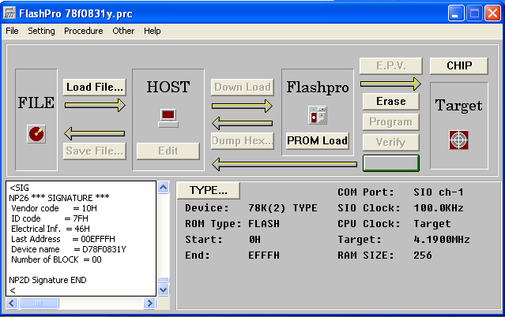

# Flash Programming

## Hardware

| FL-PR3 Probe  | uPD78F0831Y                  |
|---------------|------------------------------|
| SCK (White)   | uPD78F0831Y Pin 48 P22/SCK31 |
| SO (Yellow)   | uPD78F0831Y Pin 46 P20/SI31  | TODO verify me
| SI (Blue)     | uPD78F0831Y Pin 47 P21/SO31  | TODO verify me 
| RESET (Green) | uPD78F0831Y Pin 64 /RESET    |
| VPP (Green)   | uPD78F0831Y Pin 65 IC/VPP    |
| VDD (Red)     | uPD78F0831Y Pin 69 VDD       |
| VSS (Black)   | TA2025P Pin 5 VSS            |

Notes:

 - The 16181209 (16-pin SOIC package near the L9673D) must be temporarily
   desoldered during flash programming.

 - VSS (GND) can also be obtained by clipping onto pin 8 of the TA2025P
   (16-pin DIP package).

## FL-PR3 Settings

