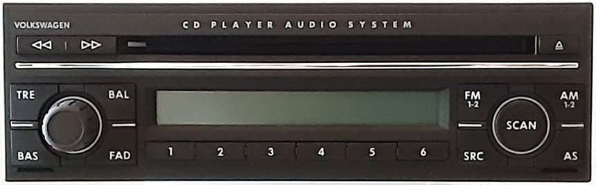

# VW SAM 2002 (Delco)

The VW SAM 2002 is a single-disc CD radio for the European market manufactured by Delco.  At first glance it appears to simply be a rebadge of the [Seat Liceo](../seat_liceo_delco).  They are extremely similar but note that the buttons do not have all the same functions.
